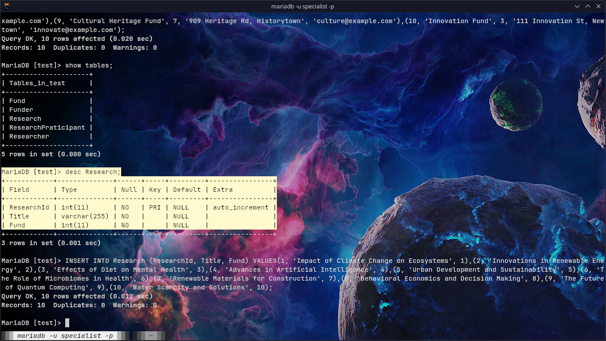
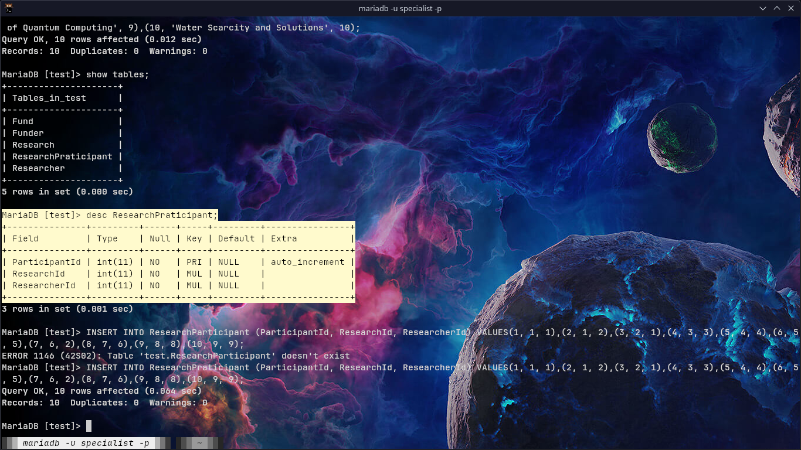

# Lab Report 1

- **Name** Abhinav Adhikari
- **Roll no** 2
- **CS II-II**

> [!NOTE]
> The project assigned to me is ResearchProjects_DB

## Schema

For this project, I decided in the following schema.


We have a Research that contains the project title and fund. A researcher table
containing information on the researcher and Funder containing one in funder.
The donation table keeps track of the each donation from the funder. ResearchPraticiapnt
keeps track of each researchers participation in a project.

## Creating table

A multiple table were created from the schema. From the following commands.
  
  
  
  
  

A photo can be made using the following command.
```sql
CREATE TABLE <TABLE_NAME>(ATRRIBUTES AND CONSTRAINTS);
```

## Inserting Values

Values can be inserted into a table using the `INSERT` keyword
```sql
INSERT INTO <TABLE_NAME>(<ATRRIBUTE>) VALUES (<VALUES>), (VALUES);
```






## Altering table

You can alter table with  

```sql
ALTER TABLE <TABLE_NAME> {ADD/MODIFY/DROP} <column_name and properties>
```

