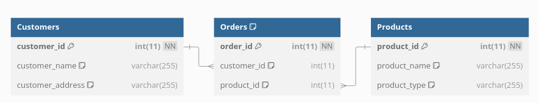
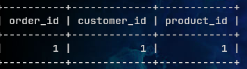
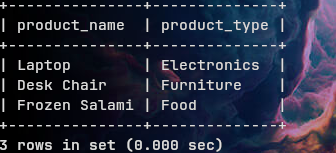
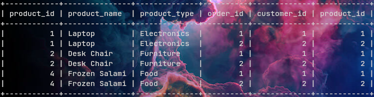

# Lab Report 1

## Preparing a Database with Foreign Key

We shall create three tables orders, customers, and products. With the following command.

```sql
CREATE TABLE Customers(customer_id int, customer_name varchar(255), customer_address varchar(255), PRIMARY KEY(customer_id));
CREATE TABLE Products(product_id int, product_name varchar(255), product_type varchar(255), PRIMARY KEY(product_id));
CREATE TABLE Orders(order_id int, customer_id int, product_id int, PRIMARY KEY(order_id), FOREIGN KEY(customer_id) REFERENCES Customers(customer_id), FOREIGN KEY(product_id) REFERENCES Products(product_id));
``` 

The foreign key keyword is used to make `product_id` in `orders` reference `product_id` in `Products`.

The relationship model we get is 


The foreign is creates a constraint that a value referenced must exist in the referenced table.
So, for the following data:


If we try to insert a product that doesn't exist using
```sql
ERROR 1452 (23000): Cannot add or update a child row: a foreign key constraint fails (`test`.`Orders`, CONSTRAINT `Orders_ibfk_1` FOREIGN KEY (`customer_id`) REFERENCES `Customers` (`customer_id`))
```

## Performing Algebraic Operation

### Selection

Selection means to filter rows based on specific criteria. The basic syntax for doing this in mySQL is
```sql
SELECT * FROM TABLE WHERE CONDITION
```
This is cause only the row where is the condition is true to be shown in view.

So, when we type
```sql
SELECT * FROM Orders WHERE product_id="2";
```

We get a result


It checks every for any row that fulfills 

### Projection

Projection means to select columns that you have specified.

The basic syntax for doing this in mySQL is
```sql
SELECT <column-name> FROM <table> 
```

We use the command
```sql
select product_name, product_type from Products;
```

We get the result.



### Cartesian Product

Cartesian Product is also known as Cross Join, it performs A Cartesian product matches each row of one table to every other row of another table, only when the WHERE condition is not specified in the query. In case the WHERE condition is specified then the Cartesian Join works as an Inner Join.

The syntax for Cartesian product is
```sql
SELECT * FROM table1 CROSS JOIN table2
```

By typing 
```sql
sELECT * FROM Products CROSS JOIN Orders;
```

We get the result




