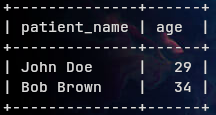

# Lab Report 3

# Selection (σ)

Selection is to select a particular row based on certain conditions.

In SQL we use the SELECT and WHERE caluse to do the selection operation.

So,

```sql
SELECT patient_name, age 
FROM Patient
WHERE age < 40;
```

causes this result



In the above example we are setting the condition using the `WHERE` clause. This is equivalent to $\sigma_{age < 40}(Doctor).

# Set Operation

## Union

Union joins two table together. Union is duplication filtering i.e. you don't need to use the DISTINCT keyword to remove duplicate data.

If we run 

```sql
SELECT patient_name AS name FROM Patient UNION SELECT doctor_name AS name FROM Doctor;
```
we get


Notice how thier is no duplication in data. 

Any set operation works by eliminiatinng duplication.

# Join Operation

Join operations work like a union operator but they don't filter duplicates by default. We need to use the DISTINCT keyword if we want this to happen.

```sql
SELECT Patient.patient_name, Doctor.doctor_name
FROM Patient
JOIN Doctor ON Patient.doctor_id = Doctor.doctor_id;
```


Note how the name the repeated. We can use the DISTINCT keyword to filter the duplicates

## LEFT JOIN

Left join only checks the ON condition for the left table.

```sql
SELECT Patient.patient_name, Doctor.doctor_name
FROM Patient
LEFT JOIN Doctor ON Patient.doctor_id = Doctor.doctor_id;
```


## RIGHT JOIN

Right join only checks the ON condition on the right table.

```sql
SELECT Patient.patient_name, Doctor.doctor_name FROM Patient RIGHT JOIN Doctor ON Patient.doctor_id = Doctor.doctor_id;
```


```sql
SELECT Patient.patient_name, Doctor.doctor_name FROM Patient RIGHT JOIN Doctor ON Patient.doctor_id = Doctor.doctor_id;
```


